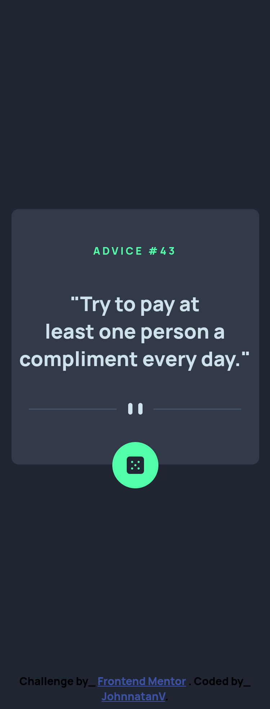
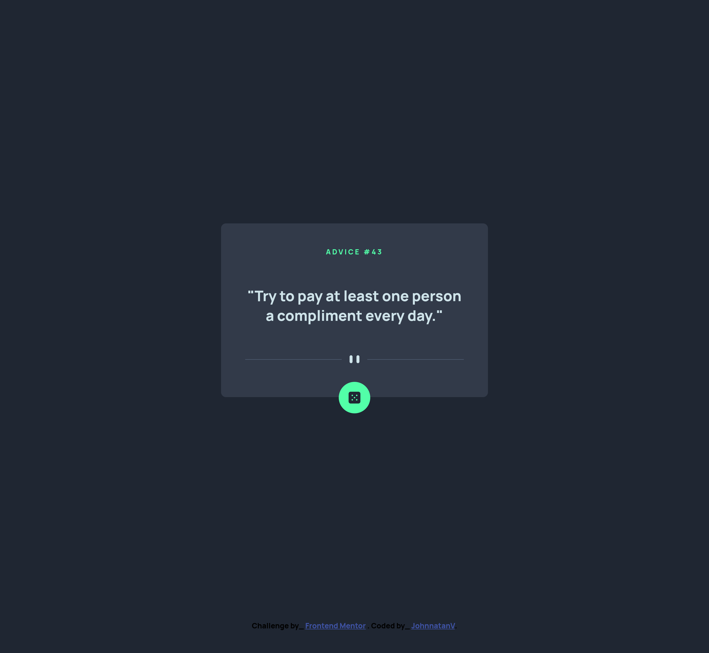

# Frontend Mentor - Advice generator app solution

This is a solution to the [Advice generator app challenge on Frontend Mentor](https://www.frontendmentor.io/challenges/advice-generator-app-QdUG-13db). Frontend Mentor challenges help you improve your coding skills by building realistic projects.

## Table of contents

- [Overview](#overview)
  - [The challenge](#the-challenge)
  - [Screenshot](#screenshot)
  - [Links](#links)
- [My process](#my-process)
  - [Built with](#built-with)
  - [What I learned](#what-i-learned)
  - [Continued development](#continued-development)
- [Author](#author)


## Overview

### The challenge

Users should be able to:

- View the optimal layout for the app depending on their device's screen size
- See hover states for all interactive elements on the page
- Generate a new piece of advice by clicking the dice icon

### Screenshot






### Links

- Solution URL: [Add solution URL here](https://github.com/JohnnatanV/advice_generator_app)
- Live Site URL: [Add live site URL here](https://advice-generator-app-phi-blond.vercel.app/)

## My process

### Built with

- Semantic HTML5 markup
- CSS custom properties
- Flexbox
- Mobile-first workflow

### What I learned

So finally get to use fetch, kinda make some mistakes but was really interesting, need to keep learning about it.

```js
let url = "https://api.adviceslip.com/advice";

  async function result(getData) {
    try {
      const urlData = await fetch(getData);
      const response = await urlData.json();
      const data = await response.slip;

      if (data.id === parseInt(cardId.innerText.slice(8))) result(url);

      cardId.innerText = `advice #${data.id}`;
      cardQuote.innerText = `"${data.advice}"`;
    } catch (error) {
      console.log(`Error caught: ${error.message}`);
    }
  }
}
```

### Continued development

Need to practice more using fetch and consuming API's is something that i need to focus more.


## Author

- Website - [JohnnatanV](https://github.com/JohnnatanV)
- Frontend Mentor - [@JohnnatanV](https://www.frontendmentor.io/profile/JohnnatanV)
